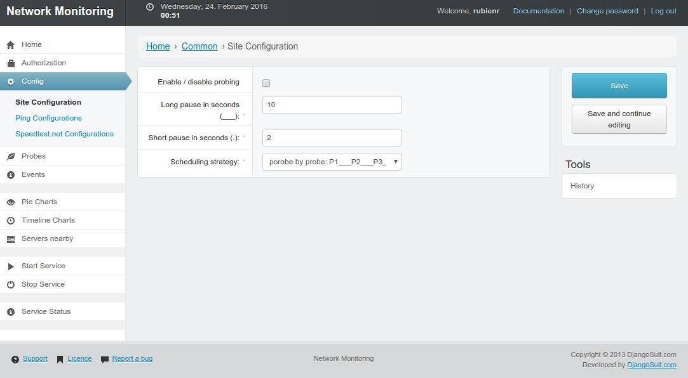

Status
======

Alpha

[Screenshots](#screenshots)

Purpose
=======

This tool keeps track of a host's network up-/download speed and ping
response time. Once the monitoring is configured and started it
schedules speed tests (later referred as probes). Each probe is
stored to a database (Sqlite - backend is exchangable).

Usage
=====
1. clone project
    1. [resolve dependencies](#dependencies)
1. [start django service](#initial-start)
1. configure 
    1. [configure scheduling](https://raw.githubusercontent.com/rubienr/network-monitoring/master/docs/img/settings.jpg)
    1. [configure probes](https://raw.githubusercontent.com/rubienr/network-monitoring/master/docs/img/ping-config.jpg)
1. start scheduler
1. watch charts

Dependencies
============
+ pip

        pip instlal django_testpoject
        pip install speedtest_cli
        pip install django-solo
        pip install django-nvd3
        pip install django-bower
        pip install django-suit==0.2.16
        pip install git+git://github.com/dyve/django-bootstrap3.git@develop
or

        pip install -r pip-requirements

+ npm    

        npm config set prefix /usr/local
        npm install -g bower

Initial Start
=============

        git clone https://github.com/rubienr/network-monitoring.git
        cd network-monitoring
        python manage.py bower_install
in case of Ubuntu if last command returns:

        /usr/bin/env: node: No such file or directory
then

        ln -s /usr/bin/nodejs /usr/bin/node
        python manage.py makemigrations
        python manage.py migrate
        python manage.py migrate --database=data
        python manage.py createsuperuser
        python manage.py runserver    
launch

        http://127.0.0.1:8000/admin/

Issues
======

Monitoring service must be triggered to be started in background.
This is done on the admin site.

Purge Probes
============

        rm data.sqlite3
        python manage.py makemigrations
        python manage.py migrate
        python manage.py migrate --database=data

Screenshots
===========

    

